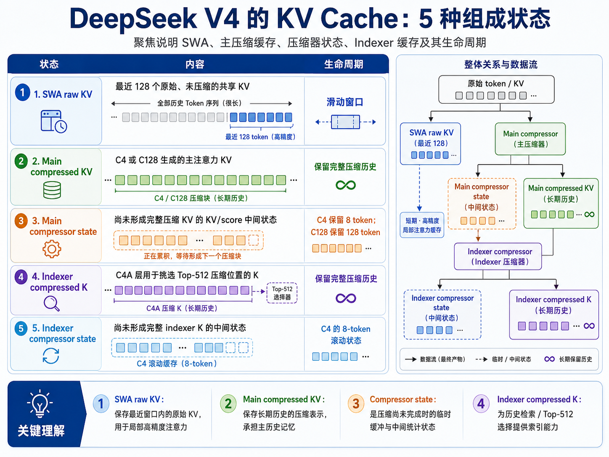
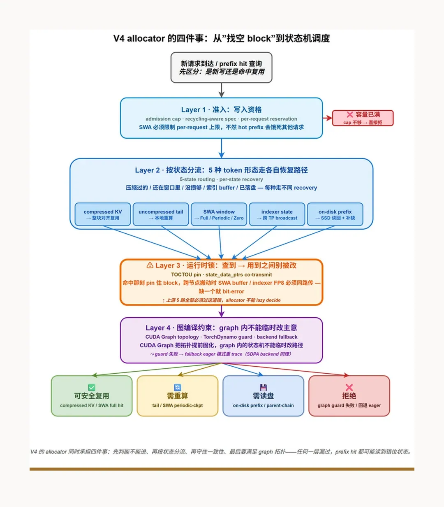

# KV cache 和底层系统

PagedAttention 主要面向按 token 顺序增长、单个缓存类型内部存储形状相对同质的 KV cache。它通过逻辑块到物理块的映射，解决动态序列长度、显存碎片和前缀共享等问题。这里“分页”的依据并不是每个 token 的语义重要性相同，而是同一类 KV 在存储尺寸和管理方式上相似，因此可以被切分成统一大小的 block [1]。

当 KV 的表示形式、可见范围和生命周期开始异构化时，单纯的分页就不够了。系统还需要在分页之上增加 cache spec、统一的逻辑坐标、多种物理投影，以及彼此独立的生命周期管理。KDA、Linear Attention、DeepSeek V4 等新结构，都对 KV cache 的管理提出了这样的要求 [2-3]。

## 从 PagedAttention 到 CacheGroup

vLLM 管理 DeepSeek V4 KV cache 的基本方式，是将具有不同存储形态和生命周期的缓存划分到不同的 `CacheGroup` 中，再由各组分别维护自己的 block table 和分页式存储。这里需要注意：每个 `CacheGroup` 都可以使用类似 PagedAttention 的分页块管理，但并不意味着它们都会执行经典的 PagedAttention 计算内核。真正消费这些缓存的，可能是 SWA、压缩注意力、Indexer 或其他专用 kernel [2]。



allocator 的本质仍然是寻找和分配空闲 block。不过在 DeepSeek V4 的场景下，仅有 allocator 已经不够：cache manager 和 coordinator 还要根据缓存类型，处理状态更新、引用关系、复用、驱逐和恢复等生命周期问题。因此，更准确地说，allocator 负责“块从哪里来”，而上层管理器负责“这些块当前处于什么状态，以及什么时候能够被复用或回收” [2]。



新请求到达后，如果没有可复用的缓存，系统会在对应的 `CacheGroup` 中分配 block，并随计算过程更新相应状态；如果命中了已有缓存，则要根据该缓存的 `Spec` 和当前状态走各自的恢复路径。

vLLM 把“用状态分流”的思路反过来用了一次：当多种底层对象在存储行为和生命周期上相似时，就用同一种 `Spec` 对它们进行描述。`Spec` 不只是用来确认恢复路径，它更像一份缓存管理契约，规定 block 大小、存储尺寸、保留窗口、前缀命中粒度，以及应该使用哪一类管理器。可以概括为：`Spec` 描述“这个状态怎样活着”，模型代码描述“这个状态拿来做什么” [2]。

如果只看 DeepSeek V4 的压缩注意力分支，可以把缓存粗略分为 `state cache` 和 `compressed KV`：前者保存生成压缩结果所需的滚动状态，后者保存已经物化、可以长期复用的压缩历史。但从整个模型看，还要把 SWA 的原始 KV 考虑进来。更完整地说，DeepSeek V4 至少包含以下几类逻辑状态：

- SWA 使用的原始 KV；
- 主压缩注意力使用的 compressed KV；
- 主压缩器的滚动 state cache；
- Indexer 使用的 K cache；
- Indexer 压缩器自己的 state cache。

这些对象的用途不同，但其中一些具有相似的存储和生命周期特征，因此可以共享同一类 `Spec`，同时由不同的模型代码和 kernel 使用 [2]。

## Linear Attention、KDA 与状态 checkpoint

**普通 Linear Attention 会把历史 K/V“累加压缩”进一个固定大小的状态矩阵。**

**KDA 则在类似的固定状态上增加逐通道遗忘，以及基于预测误差的擦除—写入机制 [3]。**

它们都能够降低长上下文的显存占用，但代价是历史信息不再以逐 token、可精确寻址的形式保存。由此会产生两个直接影响：

- prefix cache 命中时，必须存在一个与完整前缀边界严格对应的状态 checkpoint；
- 如果要保存多个可复用前缀，就需要为每个前缀保存一份完整的状态矩阵，而不能只保存少量新增 token。

因此，在 vLLM 和 SGLang 这类推理框架中，这类 checkpoint 不能简单地混入普通逐 token KV 中，而需要作为独立的状态类型或缓存池管理。具体实现可能不同，但共同点是：它们必须拥有独立的身份、生命周期和恢复逻辑。

## KV cache 的生命周期与缓存一致性

KV cache 的生命周期可以理解为一套状态机。缓存生成后，首先要判断它是否已经完整物化、是否处于稳定边界，以及能不能对外发布为可复用 cache。lookup 命中后，系统再根据缓存的类型和状态选择相应的恢复路径 [4]。

这里最容易出现问题的是 lookup 与实际使用之间的时间差。系统在 lookup 时“查到”缓存，只代表 time-of-check 时它存在；在 kernel 真正使用它时，也就是 time-of-use 时，这块缓存可能已经被并发请求或 LRU 驱逐。因此，lookup 命中后必须通过 pin 或 refcount 暂时持有所有权，直到数据读取或计算完成后才能解除引用。否则，一个逻辑上的 hit 可能在真正读取时退化成 miss，甚至造成 use-after-free [4]。

异构缓存还会带来多份物理表示之间的一致性问题。例如，同一个逻辑前缀可能同时对应 SWA 原始 KV、compressed KV 和 compressor state。它们的生命周期并不完全一致：SWA 缓存可能已经滑出窗口并被驱逐，但 compressed KV 仍然被其他请求引用；只有某一份物理缓存自己的引用计数归零，并且不再承担恢复职责时，才能真正回收。因此，不同缓存组的 eviction 时机可以不同，但它们必须共同维护同一个逻辑前缀的完整恢复语义 [4]。

换句话说，缓存一致性不只是“hash 是否命中”，还包括以下几个方面：

- 身份一致：命中的缓存必须属于相同模型、相同状态类型、相同压缩边界和相同数据布局；
- 所有权一致：从 lookup 到实际使用之间，缓存必须被 pin 或引用计数保护；
- 多表示一致：原始 KV、compressed KV 和 state cache 的存在状态必须能够组成一条完整的恢复路径；
- 可见性一致：尚未物化完成或正在搬运的缓存，不能过早暴露为普通 hit。

## KV cache offload 与底层内存

随着上下文不断增长，KV cache 的容量越来越大，offload 自然成为一个重要问题。

CPU 内存通常由操作系统以虚拟内存页进行管理，普通内存默认是 pageable 的，可能被换入或换出。GPU 如果要通过 DMA 异步读取 CPU 内存，就需要一块地址稳定的 pinned memory，避免传输期间物理页被移动或换出。因此，KV cache offload 通常会预留一个有容量上限的 pinned buffer pool，用它作为 CPU 侧的缓存池和 GPU 传输的 staging buffer [5-6]。

GPU 显存的管理方式并不完全等同于操作系统的虚拟内存分页。CUDA 和 PyTorch 通常使用 caching allocator，将较大的显存 segment 切分成可复用 block，以避免频繁调用底层显存分配接口；vLLM 则会为 KV cache 预先保留一块显存池，再通过 block ID 和 block table 管理其中的页面。也就是说，CPU 和 GPU 两侧都有 allocator，但 CPU 侧重点是虚拟内存页、换页和 pinned memory，GPU 侧重点则是显存池、block 复用和异步执行安全 [5,7]。

对于离散 GPU，CPU 与 GPU 之间的主要通信互连通常是 PCIe，而不是所有平台都固定如此；例如 Grace Hopper 这样的紧耦合平台可以使用 NVLink-C2C。以普通的 NVMe 磁盘 offload 为例，KV cache 从磁盘恢复到 GPU 通常要经过下面的路径：

```text
NVMe SSD
   │  PCIe / DMA
   ▼
CPU DRAM / pinned memory
   │  PCIe / cudaMemcpyAsync
   ▼
GPU HBM
```

第一段是 NVMe SSD 通过 PCIe 将数据 DMA 到 CPU 内存，第二段是 GPU 再通过 PCIe 将 pinned memory 中的数据搬入 HBM。因此，磁盘 offload 并不是只走一次 PCIe，它通常包含“磁盘到 CPU”和“CPU 到 GPU”两段传输。当前 vLLM 的分层 offload 设计也把 CPU primary tier 作为 GPU 与磁盘等 secondary tier 之间的网关 [8]。

如果使用 GPUDirect Storage，NVMe 设备可以通过 PCIe P2P DMA 直接把数据写入 GPU 显存，从而绕过 CPU DRAM 这个中转站。不过，CPU 仍然负责文件系统、驱动和 I/O 提交等控制路径。是否能使用这条直接路径，还取决于硬件拓扑、文件系统、驱动和框架支持 [9]。

所以，offload 的效率不仅取决于 PCIe 带宽，还取决于磁盘吞吐、CPU 内存带宽、PCIe 拓扑、传输块大小，以及能否用异步传输覆盖计算时间。PCIe 的带宽通常远低于 HBM，也低于高带宽 GPU 互连，因此如果每个 decode step 都需要把大量活跃 KV 在 CPU、磁盘和 GPU 之间来回搬运，offload 很容易变成新的瓶颈。更适合 offload 的对象，通常是暂时不活跃的请求、可长期复用的前缀，以及恢复收益明显高于重新计算成本的 KV block。

## 参考文献

[1] KWON W, LI Z, ZHUANG S, et al. Efficient memory management for large language model serving with PagedAttention[C]//Proceedings of the 29th ACM Symposium on Operating Systems Principles. New York: Association for Computing Machinery, 2023: 611-626. DOI: [10.1145/3600006.3613165](https://doi.org/10.1145/3600006.3613165).

[2] VLLM TEAM. DeepSeek V4 in vLLM: Efficient long-context attention[EB/OL]. (2026-04-24)[2026-07-26]. [https://vllm.ai/blog/2026-04-24-deepseek-v4](https://vllm.ai/blog/2026-04-24-deepseek-v4).

[3] KIMI TEAM, ZHANG Y, LIN Z, et al. Kimi Linear: An expressive, efficient attention architecture[EB/OL]. (2025-10-30)[2026-07-26]. [https://arxiv.org/abs/2510.26692](https://arxiv.org/abs/2510.26692).

[4] PagedAttention 失效后世界会怎样？[4][EB/OL]. [2026-07-26]. [http://xhslink.cn/o/5x8eojoiGmK](http://xhslink.cn/o/5x8eojoiGmK). 原始页面：[https://www.xiaohongshu.com/discovery/item/6a3821fe00000000070205a5](https://www.xiaohongshu.com/discovery/item/6a3821fe00000000070205a5).

[5] 廖一桥. PyTorch 训练显存管理：从 Caching Allocator 到 Stream 同步[EB/OL]. [2026-07-26]. [http://xhslink.cn/o/1cEEkxkMYl9](http://xhslink.cn/o/1cEEkxkMYl9).

[6] NVIDIA CORPORATION. CUDA Programming Guide: Page-locked host memory[EB/OL]. [2026-07-26]. [https://docs.nvidia.com/cuda/cuda-programming-guide/02-basics/understanding-memory.html](https://docs.nvidia.com/cuda/cuda-programming-guide/02-basics/understanding-memory.html).

[7] PYTORCH CONTRIBUTORS. CUDA semantics: Memory management[EB/OL]. [2026-07-26]. [https://docs.pytorch.org/docs/main/notes/cuda.html](https://docs.pytorch.org/docs/main/notes/cuda.html).

[8] VLLM PROJECT. KV Offloading Usage Guide[EB/OL]. (2026-07-20)[2026-07-26]. [https://docs.vllm.ai/en/latest/features/kv_offloading_usage/](https://docs.vllm.ai/en/latest/features/kv_offloading_usage/).

[9] NVIDIA CORPORATION. NVIDIA Magnum IO GPUDirect Storage Overview Guide[EB/OL]. [2026-07-26]. [https://docs.nvidia.com/gpudirect-storage/overview-guide/](https://docs.nvidia.com/gpudirect-storage/overview-guide/).
