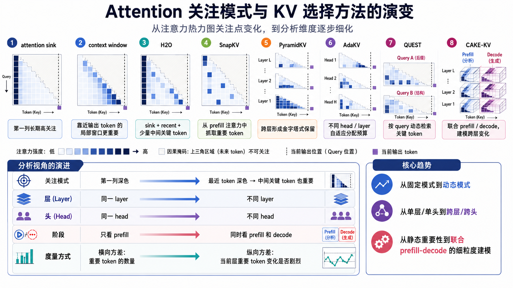
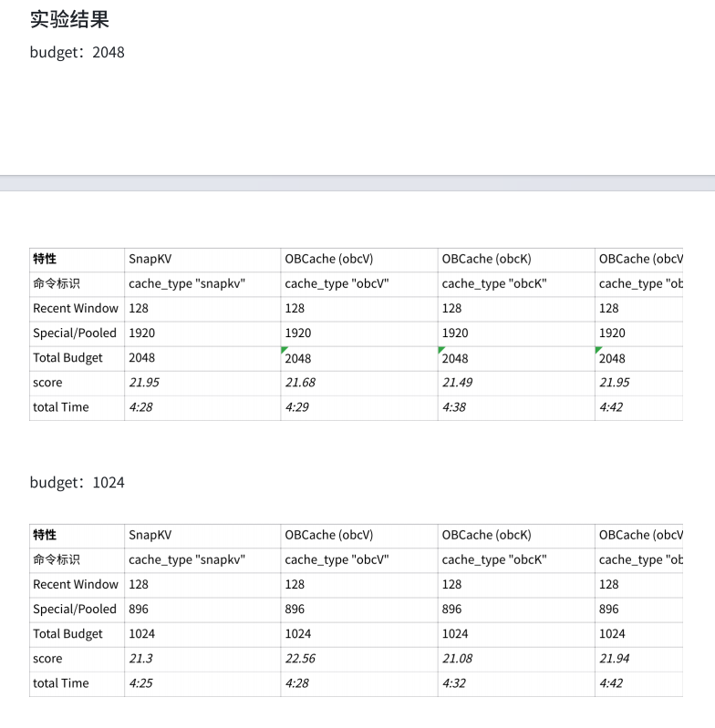
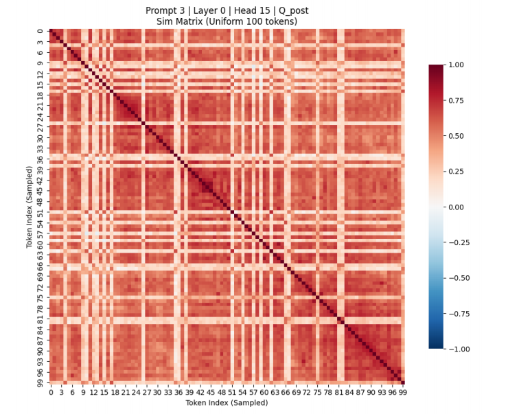
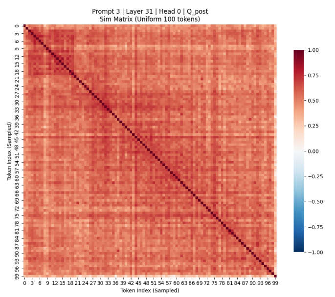
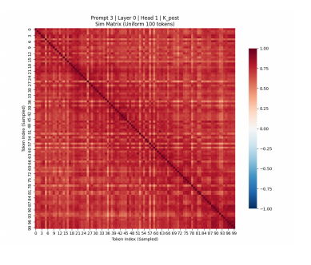
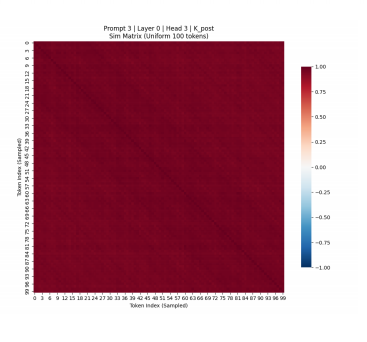
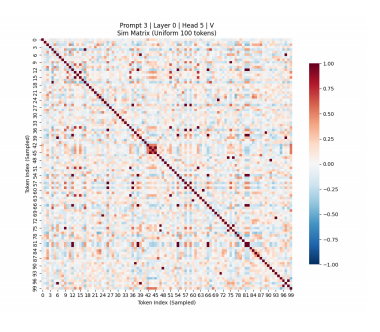
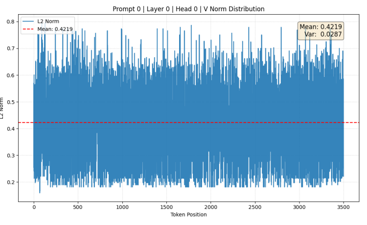
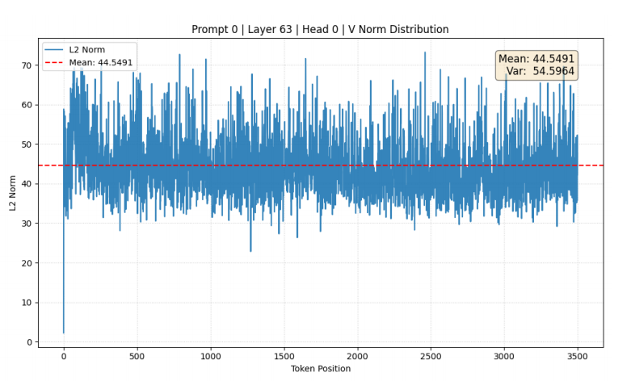
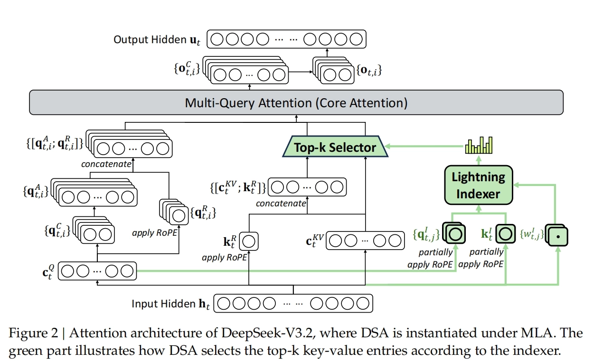

# KV Cache Compression

这篇笔记整理了 KV Cache 压缩方向的论文调研、实验复现与个人思考。

- [PDF 版本](./kv-cache-compression.pdf)
- [小红书版本](https://www.xiaohongshu.com/explore/6a005000000000003601f7cd)

这篇文章主要是结合我实习期间对 KV cache compression 的论文调研、实验复现和一些个人思考整理出来的。它不是一篇单纯的科普文章，因为 KV cache 的基本概念现在大家都能很快查到；我更想写的是：在我看来，当我们具体讨论 KV cache eviction，也就是要删除或换出哪些 token 的 KV cache 时，真正应该看什么，以及现有方法为什么会沿着某些方向演进。

## 什么是 KV cache？

在 Transformer 中，每一轮 forward 计算主要由注意力计算和 FFN（Feed-Forward Network，前馈网络）计算两大部分组成。在注意力计算中，每一轮自回归生成都会用到之前 token 的 Key 和 Value，因此需要把这些 KV 值缓存下来。缓存下来的这部分内容，就叫做 KV cache。

从状态机的角度来看，KV cache 可以理解为过去时间步留下来的历史状态。Transformer 当前状态的转移依赖于历史状态和当前输入状态，这是我自己的一种理解，供参考。

## KV cache eviction

进入长上下文时代之后，KV cache 的长度急剧增长，随之而来的是计算和存储两方面的挑战。于是大家开始问一个问题：所有 KV cache 都重要吗？能不能去掉一部分 KV cache，从而降低计算和存储压力？

我认为这个问题的关键，其实是要先问清楚：KV cache 对谁重要？KV cache 直接影响的是注意力权重 $A$，进而影响 $A V$，再进一步影响经过输出投影后的注意力输出 $O$。注意力输出会影响当前 layer 的 hidden state，而每一层 hidden state 的变化又会继续传递到最后一层，最终反映到词表上的概率分布。因此，如果从最本质的角度看，一个 token 的 KV cache 是否重要，应该取决于删除它之后，最终生成概率分布发生了多大的偏移。

用概率分布偏移来定义重要性是最合理的，但难点也很明显：在真正驱逐 token 的时候，我们很难提前知道删除某个 KV cache 会让最终概率分布偏移多少。我看过一些 MoE 相关论文，例如 Expert pruning 方向会通过删除专家后概率分布的偏移来衡量专家重要性 [1]。这个思路同样可以迁移到 KV cache eviction 上，而且从定义上看也更贴近本质。

问题在于，KV cache 的数量太多了。假如上下文长度是 200K，那么可选的驱逐组合数量会非常夸张，几乎不可能遍历。我也想过一些折中方式，比如按 block 驱逐来减少组合空间，但即便这样，遍历次数仍然很大。对于这条思路，我目前还没有找到很好的解决办法，先写在这里，供有缘人参考。

## KV cache 的影响

如果不直接衡量最终概率分布，我们就只能沿着 Transformer 的计算链路往前找代理指标。按照我的理解，KV cache 的影响至少可以分为四层：对 $A$ 的影响、对 $A V$ 的影响、对 attention output 的影响，以及对 FFN output 的影响。下面我按这个顺序展开。

### attention 层

既然要衡量 KV cache 对注意力输出的重要性，就应该先从注意力输出公式开始看：

$$
o = A V W^{O}, \quad \text{where } A = \operatorname{softmax}\left(\frac{qK^{T}}{\sqrt{d}}\right)
$$

从这个公式可以自然想到，KV cache 的影响可以分成三层：它先影响 $A$，再影响 $A V$，最后影响经过 $W^O$ 之后的 attention output。

#### 对 $A$ 的影响

前人对于 KV cache 重要性的观察，很多都建立在注意力分数热力图上。根据我看过的文章，这条线大概可以梳理为：

Attention Sink / StreamingLLM [2] -> H2O [3] -> Scissorhands [4] -> SnapKV [5] -> PyramidKV [6] -> Ada-KV [7] -> Quest [8] -> CAKE [9]。

这条线的变化其实很有意思：先是关注热力图第一列颜色较深，也就是 attention sink；然后发现离输出 token 最近的一段 context window 经常很重要；再到 H2O 这类方法开始用累计注意力去找 heavy hitter token；之后又进一步观察不同 layer、不同 head、prefill 和 decode 阶段之间的差异。换句话说，研究视角从“同一个 layer”扩展到“不同 layer”，从“同一个 head”扩展到“不同 head”，从“只看 prefill”扩展到“prefill 和 decode 同时看”。

我自己把这部分现象整理成了一张图，如图 1 所示。

**图1 注意力分数视角下的 KV cache eviction 方法演进。** 这张图主要整理了从 attention sink、context window、累计注意力，到 layer/head 自适应分配等方法之间的关系。这里的 eviction 特指通过重要性判断删除或保留部分 token 的 KV cache。

据我的了解，当前研究已经把注意力分数热力图从很多角度研究过了，似乎很难再从同一个视角里挖出特别新的信息。当然，我想提醒的是，上面这些现象都默认了一个前提：注意力分数高，确实反映了 $q$ 和 $k$ 的相关性高。但最近也有工作开始重新思考这一点，例如 Gated Attention 认为 attention sink 可能来源于 Softmax 函数的非负归一化特性，而不一定完全来自语义相关性 [10]。

这就引出了一个我觉得值得追问的问题：图 1 中提到的其他高注意力现象，到底是在真实反映 $q$ 和 $k$ 的相关性，还是由某些数学机制带来的？如果未来模型结构改变，Softmax 被换成其他函数，这些现象是否还会存在？我觉得这可能是未来值得研究的一个点。

#### 对 $A V$ 的影响

从公式中可以很容易看出，注意力输出不仅由 $A$ 决定，也受到 $V$ 的影响。因此，只用 attention score 判断 token 重要性，天然会漏掉 Value 侧的信息。

《Attention Score is not All You Need for Token Importance Indicator in KV Cache Reduction: Value Also Matters》是我看到的比较早明确提出这一点的文章 [11]。我们姑且可以把它看作这一流派的起点。它使用 Value 向量的 $L_1$ 范数来修正注意力分数。对于解码步骤 $t$ 时的第 $k$ 个 token，它的综合重要性得分 $I_k^t$ 可以写成：

$$
I_k^t = S_k^t \cdot ||v_k||_1
$$

其中，$S_k^t$ 是该 token 的注意力分数。在实际应用中，它可以是 H2O 中的累计注意力分数，也可以是 Scissorhands 中基于历史窗口的注意力分数；$||v_k||_1$ 则是该 token 对应 Value 向量的 $L_1$ 范数。

这种判断方式本质上是对当前 token 的 attention output 做一个简单模拟。当然，这篇文章毕竟是这一流派的起点，它的核心价值不在于指标已经完美，而在于它明确指出：判断 KV cache 重要性时，不能只看 $A$，还要把 $V$ 的影响纳入进来。所以我认为它是非常有价值的，虽然效果不一定总是最好。

#### 对 attention output 的影响

按照我的理解，《Identify Critical KV Cache in LLM Inference from an Output Perturbation Perspective》又把公式往外推了一层 [12]。它不只是看 $V$，而是看更本质的 attention output。因为在 Transformer 的注意力机制中，加权求和后的结果还要经过输出投影矩阵 $W^O$。这个预训练参数矩阵会改变数据分布，它可能放大某些 Value 向量，也可能抑制另一些 Value 向量。

因此，这篇文章的核心思路是定义一个 output perturbation 的上限，然后按照两个指标驱逐 KV cache，直到接近预设上限：

- 注意力权重 $A$：这是传统的评判标准。
- 投影后的 Value 状态范数 $||\mathcal{V}_{i,:}||_1$：其中 $\mathcal{V}=V W^O$，也就是原本 Value 状态经过输出矩阵 $W^O$ 投影后的结果。

还有一篇文章《OBCache: Optimal Brain KV Cache Pruning for Efficient Long-Context LLM Inference》，核心出发点也是减少 output perturbation，但它的方法更偏数学推导，提出了一种确定性的指标来衡量 perturbation [13]。

$$
S_{p}^{value}=\sum_{i}|A_{i,p}|^{2}\cdot||v_{p}||^{2}
$$

$$
S_{p}^{key}=\sum_{i}|A_{i,p}\cdot Z_{i,p}|^{2}\cdot||v_{p}-o_{i}||^{2}
$$

$$
S_{p}^{joint}=2\sum_{i}|A_{i,p}|^{2}\cdot Z_{i,p}\cdot(||v_{p}||^{2}-v_{p}^{\top}o_{i})+S_{p}^{value}+S_{p}^{key}
$$

这里的 $S_{p}^{joint}$ 就是第 $p$ 个 token 的重要性分数，它同时和 $A$、$Z$、$v$、$o$ 相关。具体推导过程我就不放在这篇文章里了。当时我自己推了一天，确认它的数学推导过程是对的。

不过，我认为这个方法的主要问题在于额外计算量较多。在我的复现过程中，这些新的计算方式并没有换来对应的收益。我是以 benchmark 分数来衡量的，最后看到的 benchmark 分数和计算时间之间的 trade-off 并不让人满意。当时测到的数据如图 2 所示。

**图2 OBCache 复现过程中的 benchmark 结果。** 这组结果主要用于观察 output perturbation 类指标在实际 benchmark 上是否能抵消其额外计算开销。

大多数情况下，KV cache eviction 的目标是驱逐不重要的 token，保留下来的 token 数量是固定的。也就是说，我们需要的不是一个 token 的 KV cache 精确重要性数值，而是相对顺序：哪些 token 比哪些 token 更重要。因此，重要性分数本身是可以放缩的，只要保证排序关系不变，就应该尽可能减少计算量，避免让 indexer 自己成为性能瓶颈。

针对 OBCache 的方法，我比较了它和传统 baseline 的计算量和访存量。粗略来看，它大概是传统方法的两倍开销，如表 1 所示。这不是一个很值得接受的代价，所以我猜这也是这篇论文被拒的原因之一。

**表1 传统注意力分数类方法与 OBCache Joint 方法的理论开销对比。**

| 比较维度 | 传统 Baseline 方法，如 H2O / SnapKV | OBCache Joint 方法 | 相对开销与增加比例 |
| --- | --- | --- | --- |
| 计算核心动作 | 局部重算 $Z = QK^\top$ | 局部重算 $Z = QK^\top$，并额外计算交叉项 $OV^\top$ | 增加了一个与 baseline 规模相同的矩阵乘法 |
| 理论计算量 FLOPs | $\approx 2 \cdot W \cdot L \cdot D$ | $\approx 4 \cdot W \cdot L \cdot D$ | 约 2 倍。范数和逐点运算开销较小，这里忽略 |
| 访存核心动作 | 从 HBM 读取 $Q$ 和 $K$ | 读取 $Q$、$K$，并额外读取全局 $V$ 和窗口 $O$ | 额外增加了对 $V$ 和 $O$ 的读取 |
| 理论访存量 Elements | $(W + L) \cdot D$ | $(2W + 2L) \cdot D$ | 约 2 倍 |

### FFN 层

#### 对 FFN output 的影响

上面讨论的主要还是 attention 层。但在我的研究过程中，我发现几乎没有人专门研究 MoE 场景下的 KV 压缩。很多人默认 MoE 主要是 FFN 层的稀疏化，attention 模块对它没有特别直接的影响。

我认为这里有一个问题值得关注：删除那些对 attention output 影响最小的 KV cache，真的也会让 FFN output 的变化最小吗？一些研究表明，MoE 专家会有自己的职责分工 [1]。那么，删除某些 KV cache 后得到的 attention output，其语义是否可能发生较大偏转，从而使处理它们的专家也发生改变？

我现在还没法回答这个问题，也没有设计出好的实验去验证。核心原因还是 FFN 层的非线性太强了。虽然我们说它是 expert，但其实也没人真正知道它是哪方面的 expert。Anthropic 之前的可解释性研究也更多是把 FFN 层拆开以后，从矩阵连接方式去理解权重参数的意义 [14]。总而言之，我认为这是一个可以继续思考的角度。

## KV cache 本身的特点

既然要研究 KV cache，我们就应该关注它本身的特点，尝试从 KV cache 自身的结构出发思考如何做 eviction。下面我结合自己的一些实验和看过的论文，讲讲我观察到的三类现象。

第一，经过位置编码处理后的 $q$ 和 $k$，不同 token 之间夹角的余弦值基本都是正的；而 $v$ 则基本上有正有负。这个现象说明，$Q/K$ 和 $V$ 在几何分布上并不完全相同，因此后续如果要设计 KV cache compression 方法，也许不应该默认 Key 和 Value 可以用完全相同的方式处理。

第二，不同 head 之间的 $q$、$k$、$v$ 呈现出不同的几何结构。也就是说，head 之间并不是简单的同质重复，不同 head 里的向量夹角分布本身就带有差异。

不同 head 的 $q$ 之间夹角大致呈现如图 3 和图 4 所示的形状。

|  |  |
| --- | --- |
| **图3 不同 head 的 Q 向量夹角余弦分布之一。** | **图4 不同 head 的 Q 向量夹角余弦分布之二。** |

$K$ 之间的夹角大致呈现如图 5 和图 6 所示的形状。

|  |  |
| --- | --- |
| **图5 不同 head 的 K 向量夹角余弦分布之一。** | **图6 不同 head 的 K 向量夹角余弦分布之二。** |

$V$ 之间的夹角则呈现出另一种形状，如图 7 所示。把 $Q$、$K$、$V$ 放在一起看，可以发现它们虽然都来自同一个 attention block，但内部几何结构并不完全一致，这也是我觉得 KV cache 本身值得被单独研究的原因。

**图7 不同 head 的 V 向量夹角余弦分布。**

第三，从 $V$ 的 $L_2$ 范数角度看，随着 layer 增长，$V$ 的 $L_2$ 范数整体会变大，如图 8 和图 9 所示。

**图8 V 向量 $L_2$ 范数随 layer 变化的实验结果之一。**

**图9 V 向量 $L_2$ 范数随 layer 变化的实验结果之二。**

这些都是我做实验时观察到的现象。怎么解释并利用这些现象，仍然值得继续思考。我关注到的一些论文也在沿着类似方向走，例如 DiffKV 会对 Key 和 Value 采用不同的压缩策略，背后的直觉就是 K 和 V 对注意力计算的影响并不完全一样 [15]；KIVI 也指出 Key 和 Value 的量化粒度应该区分开来，Key 更适合 per-channel，Value 更适合 per-token [16]。也许这里面还有很多内容可以挖。

## KV cache compression 的实际运用情况

前面更多是在讲“应该如何判断重要性”。但真正落地时，KV cache compression 面对的不只是算法指标问题，还要回到系统里的两个基本约束：计算和存储。计算侧关心的是，如何在 decode 阶段少算、快算，并且不要让 indexer 自己成为新的瓶颈；存储侧关心的是，长上下文下巨大的 KV cache 到底应该放在哪里，是永久驱逐，还是分层存储和按需取回。

所以这一节我主要从这两个角度展开：先用 DeepSeek Sparse Attention（DSA）讨论计算侧的稀疏选择和轻量 indexer，再用 KV cache offloading 讨论存储侧为什么不一定应该永久删除 KV cache。

### 计算侧的稀疏选择：DSA

在计算侧，KV cache compression 最直接的目标是减少 decode 阶段实际参与 attention 计算的 KV 数量。DeepSeek 的 sparse attention 演进就是一个很好的例子：它并不是简单地永久删除 KV cache，而是通过轻量级 indexer 在每一步选择当前最值得访问的 token。

按照我的理解，DeepSeek 对稀疏推理的利用大概经历了三个阶段：

NSA [17] -> DeepSeek Sparse Attention / DSA [18] -> Hybrid Attention with CSA and HCA，也就是 DeepSeek-V4 里的混合注意力设计 [19]。

NSA 有点像集成了我前面在“对 $A$ 的影响”那一节梳理过的很多论文思路。它的大体做法是：离输出 token 最近的窗口内 token 的 KV cache 全部保留；更远的 token 先经过块压缩做初筛，然后保留选中块里的 token。

DSA 后续没有完全采用这种带有强先验的方式，而是直接使用一个小头数、可 FP8 化、带 ReLU 的 learned scorer 作为 lightning indexer。我的理解是，DeepSeek 对 NSA 这种带先验知识的选择仍然不够放心，所以选择了更可训练的打分方式。到 DeepSeek-V4，CSA 和 HCA 又把压缩与稀疏选择结合起来：CSA 先把 KV cache 压缩后再做 top-k 选择，HCA 则把 KV 压缩到足够短之后直接做 dense attention。我感觉这已经是在把 KV cache 压缩往极致推了。

top-k 选择一定要轻量，否则会成为性能瓶颈。DSA 的 indexer 为了轻量做了几件事：

- indexer 使用的 Key 被压缩到很低的维度，例如 128 维，并且这部分 cache 会单独存储。
- indexer 可以采用 FP8 量化。
- indexer 的 query head 数设置得很小。

DSA 的整体结构如图 10 所示。

**图10 DeepSeek Sparse Attention 中 lightning indexer 的整体结构。** 该结构通过轻量 indexer 先选出候选 token，再执行稀疏 attention，从而降低长上下文场景下的 attention 访存和计算压力。

这里我想补充一点自己的猜想。对于 top-k 算子的实现，当前工业界类似 radix-select 的方法在工程实现上可能已经很强了，但它们没有充分利用上一次 top-k 选择的信息。

我在研究过程中发现，相邻 query 的余弦相似度比较高，这意味着它们选择的 token 很可能有较大重合。我认为这个现象有两点原因：

1. 注意力计算中，向 $q$ 和 $k$ 添加的 RoPE 信息很大程度上决定了 $qk^\top$ 的结果。对于同一个 token 的 $K$，相邻 query 的相对距离接近，这部分相乘结果也接近，因此相邻 query 的 top-k token 会有一部分重合。
2. 相邻 query 的位置接近，语义通常也相似，所以它们也倾向于选择相似的 token。

因此，上一次 top-k 选择的信息是可以被利用的。NVIDIA 的论文《Guess-Verify-Refine: Data-Aware Top-K for Sparse-Attention Decoding on Blackwell via Temporal Correlation》就用一个比较巧妙的数学方法利用了这个性质：它把注意力分数的 CDF 看作函数，用类似正割法的方式求解阈值，并利用相邻 decode step 的 temporal correlation 来加速精确 top-k [20]。这也算是工业界对我这个直觉的一个验证。

### 存储侧的分层管理：KV cache offloading

计算侧可以通过 sparse attention 减少每一步实际访问和计算的 KV 数量，但存储侧的问题并不会因此自动消失。只要上下文足够长，完整 KV cache 仍然需要占用大量显存或其他存储空间。KV cache eviction的想法就是继续做永久驱逐：既然某些 token 当前不重要，就直接删掉它们。

但我后来逐渐觉得，永久驱逐可能不是最合理的方向，KV cache offloading 反而更符合长上下文推理的实际访问模式。原因在于，一个 token 在某一步没有被选中，并不代表它在后续所有 decode step 中都不会再被选中。我们可以先算一个简单的概率：在长上下文和反复 decode 的场景下，一个 token 从未被选中的概率几乎为 0。我之前还下过一个判断，说有的 token 可能永远不会被选中，现在看有点过于 naive 了。

这里参考《大模型推理系统(2)--体系结构的视角》里的推导 [21]（这里的推导的前提是所有token没有内生差异，是被均等选择的，实际场景有待确认）：

> 以 DeepSeek DSA 为例，indexer 需要存储 $seq\_len \times (1 + 1 / block\_size) \times indexer\_head\_dim$。假设 $seq\_len = 200K$，$block\_size = 128$，$indexer\_head\_dim = 128$，则 indexer 的 KV cache 开销为 $25,800KB$。对于 MLA 部分，虽然 Sparse Attention 基于 indexer $topk = 2048$ 仅会选择 $2048$ 个 K 参与运算。但是对于一个 $200K$ context，每个 token 都会选择其中 $2048$ 个 key。对于单次选择，token 不被选中的概率为 $p_{miss} = \frac{C(seq\_len - 1, topk)}{C(seq\_len, topk)} = 1 - \frac{topk}{seq\_len} \approx 0.9899976$。由于选择需要执行 $seqlen$ 次，那么一个 token 的 key 从未被选中的概率为 $P(p_{miss})^{seq\_len}$，由此可知单个 token 未被选中的概率几乎为零。因此 KV cache 的用量为 $layers \times seq\_len \times (kv\_lora\_rank + qk\_rope\_head\_dim) = 61 \times 200K \times 576 = 7027,200KB$。即单个 token 需要 $35KB$。如果能够采用 NVFP4 量化，则需要 $17.5KB$。对于 Sparse Attention 来看，在 Decode 阶段的访存量会小很多，仅有 indexer kcache 需要全量访问，而计算出 top-k 后仅需要访问 top-k 个 MLA 的 Key。

如果这个推导成立，那么“永久删除”就会变得比较危险：某个 token 当前不重要，并不意味着它未来永远不会被选中。相比之下，KV cache offloading 更像是把低频访问的 KV cache 移到更便宜的存储层级，而不是直接宣判它无用。

DeepSeek-V4 的 KV cache 似乎已经在朝全量放到 SSD 的方向发展，SGLang 的 HiCache 也支持了类似 feature。这说明工业界也在逐渐支持一个观点：在长上下文场景下，问题可能不是“哪些 KV cache 永远没用”，而是“哪些 KV cache 当前不值得放在最贵、最快的显存里”。

## 参考文献

[1] Lu X, Liu Q, Xu Y, et al. Not All Experts are Equal: Efficient Expert Pruning and Skipping for Mixture-of-Experts Large Language Models[EB/OL]. arXiv:2402.14800, 2024. https://arxiv.org/abs/2402.14800

[2] Xiao G, Tian Y, Chen B, et al. Efficient Streaming Language Models with Attention Sinks[EB/OL]. arXiv:2309.17453, 2023. https://arxiv.org/abs/2309.17453

[3] Zhang Z, Sheng Y, Zhou T, et al. H2O: Heavy-Hitter Oracle for Efficient Generative Inference of Large Language Models[EB/OL]. arXiv:2306.14048, 2023. https://arxiv.org/abs/2306.14048

[4] Liu Z, Desai A, Liao F, et al. Scissorhands: Exploiting the Persistence of Importance Hypothesis for LLM KV Cache Compression at Test Time[C]//Advances in Neural Information Processing Systems. 2023. https://arxiv.org/abs/2305.17118

[5] Li Y, Huang Y, Yang B, et al. SnapKV: LLM Knows What You are Looking for Before Generation[EB/OL]. arXiv:2404.14469, 2024. https://arxiv.org/abs/2404.14469

[6] Cai Z, Zhang Y, Gao B, et al. PyramidKV: Dynamic KV Cache Compression based on Pyramidal Information Funneling[EB/OL]. arXiv:2406.02069, 2024. https://arxiv.org/abs/2406.02069

[7] Feng Y, Lv J, Cao Y, et al. Ada-KV: Optimizing KV Cache Eviction by Adaptive Budget Allocation for Efficient LLM Inference[EB/OL]. arXiv:2407.11550, 2024. https://arxiv.org/abs/2407.11550

[8] Tang J, Zhao Y, Zhu K, et al. Quest: Query-Aware Sparsity for Efficient Long-Context LLM Inference[EB/OL]. arXiv:2406.10774, 2024. https://arxiv.org/abs/2406.10774

[9] Qin Z, Cao Y, Lin M, et al. CAKE: Cascading and Adaptive KV Cache Eviction with Layer Preferences[EB/OL]. arXiv:2503.12491, 2025. https://arxiv.org/abs/2503.12491

[10] Qiu Z, Wang Z, Zheng B, et al. Gated Attention for Large Language Models: Non-linearity, Sparsity, and Attention-Sink-Free[EB/OL]. arXiv:2505.06708, 2025. https://arxiv.org/abs/2505.06708

[11] Guo Z, Kamigaito H, Watanabe T. Attention Score is not All You Need for Token Importance Indicator in KV Cache Reduction: Value Also Matters[C]//Proceedings of the 2024 Conference on Empirical Methods in Natural Language Processing. 2024. https://arxiv.org/abs/2406.12335

[12] Feng Y, Lv J, Cao Y, et al. Identify Critical KV Cache in LLM Inference from an Output Perturbation Perspective[EB/OL]. arXiv:2502.03805, 2025. https://arxiv.org/abs/2502.03805

[13] Gu Y, Liang X, Zhao J, et al. OBCache: Optimal Brain KV Cache Pruning for Efficient Long-Context LLM Inference[EB/OL]. arXiv:2510.07651, 2025. https://arxiv.org/abs/2510.07651

[14] Elhage N, Nanda N, Olsson C, et al. A Mathematical Framework for Transformer Circuits[EB/OL]. Transformer Circuits, 2021. https://transformer-circuits.pub/2021/framework/index.html

[15] Zhang Y, Hu Y, Zhao R, et al. DiffKV: Differentiated Memory Management for Large Language Models with Parallel KV Compaction[EB/OL]. arXiv:2412.03131, 2024. https://arxiv.org/abs/2412.03131

[16] Liu Z, Yuan J, Jin H, et al. KIVI: A Tuning-Free Asymmetric 2bit Quantization for KV Cache[EB/OL]. arXiv:2402.02750, 2024. https://arxiv.org/abs/2402.02750

[17] Yuan J, Gao H, Dai D, et al. Native Sparse Attention: Hardware-Aligned and Natively Trainable Sparse Attention[EB/OL]. arXiv:2502.11089, 2025. https://arxiv.org/abs/2502.11089

[18] DeepSeek-AI. DeepSeek-V3.2-Exp: Boosting Long-Context Efficiency with DeepSeek Sparse Attention[EB/OL]. 2025. https://github.com/deepseek-ai/DeepSeek-V3.2-Exp

[19] Hugging Face. DeepSeek-V4: a million-token context that agents can actually use[EB/OL]. 2026. https://huggingface.co/blog/deepseekv4

[20] Cheng L, Zhao R, Liu T, et al. Guess-Verify-Refine: Data-Aware Top-K for Sparse-Attention Decoding on Blackwell via Temporal Correlation[EB/OL]. arXiv:2604.22312, 2026. https://arxiv.org/abs/2604.22312

[21] 大模型推理系统(2)--体系结构的视角[EB/OL]. https://mp.weixin.qq.com/s/LSeon62IEtUsLwnLeXBZ0Q
