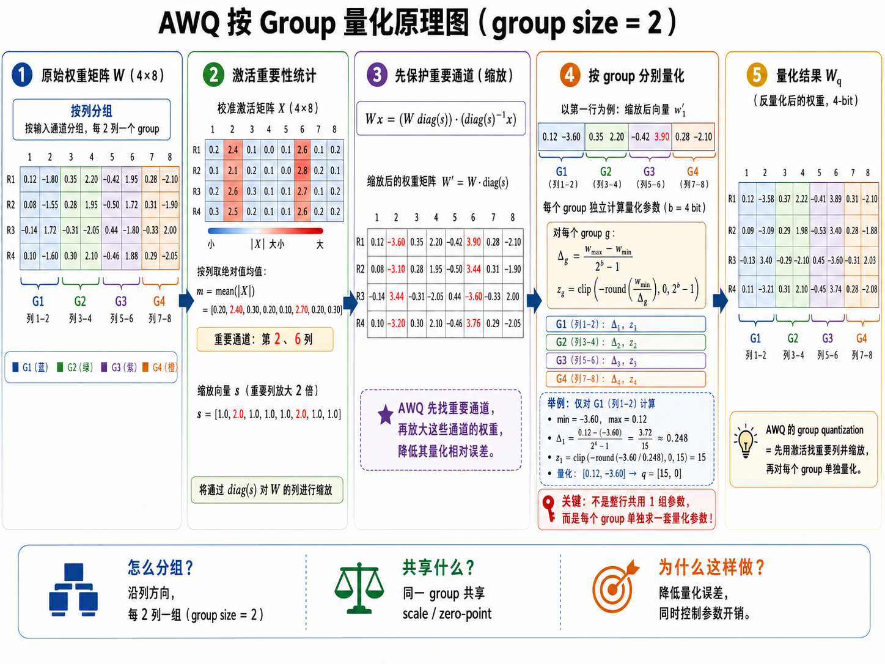
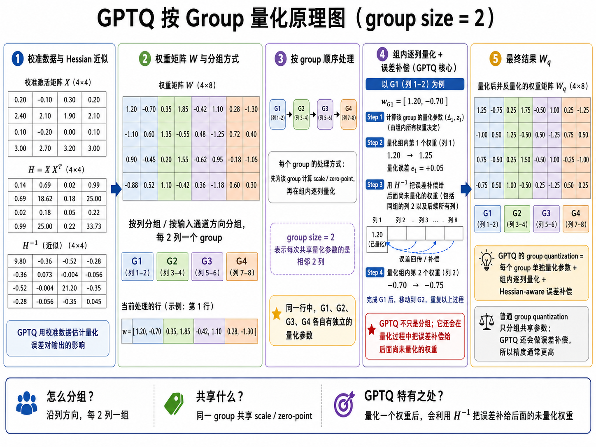
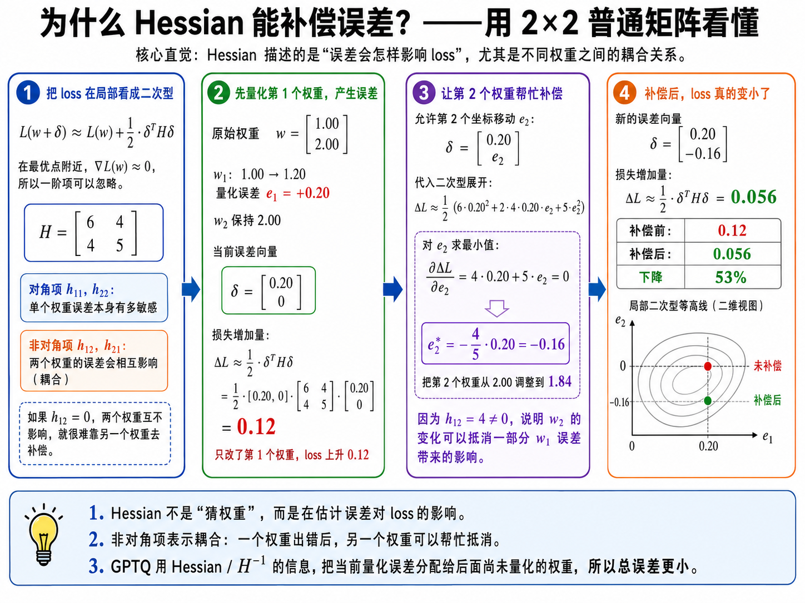

# 模型量化

这篇文章聊聊模型量化，主要是为了梳理我做过的东西背后的原理，以及一些我感兴趣的问题。

模型量化的本质，是用较低精度的数值格式近似表示神经网络中的高精度数值，以可接受的精度损失换取更少的存储占用和更高的计算效率 [1]。

我有一个有意思的理解：从单个数值来看，量化确实丢掉了一部分精度；但从矩阵整体来看，这部分信息造成的影响不一定只能靠额外的元数据保存，也可以借助矩阵本身的冗余和元素之间的相关性，重新分摊到其他元素上。换句话说，我们不一定要逐元素还原原矩阵，而是可以调整矩阵中其他仍有自由度的数值，使它在关键输入上的矩阵乘积或层输出尽量保持不变。后面会讲到的 GPTQ，就是把当前权重量化产生的误差补偿到尚未量化的权重上 [2]。因此，我更愿意把它理解为：局部丢失的信息，可以由矩阵整体的表示能力来承载。它仍然是有损的，只是损失对最终输出的影响被重新分配和压低了。

但是，数据在低精度表示和计算中流动时会产生并累积误差，这也是为什么多数低比特量化很难做到严格无损。我还有一个未经验证的猜想：Transformer 架构的中间状态能够承载的有效信息或许存在上限；如果要进一步改善表现，可能需要 mHC 这类改变信息流的架构 [3]。不过，这个猜想和本文后面的量化讨论关系不大，先按下不表。

接下来从几个维度讲讲常见的量化方式。

## 量化阶段

从量化发生在模型训练流程中的阶段来看，可以分为：

- 量化感知训练（QAT，Quantization-Aware Training）
- 训练后量化（PTQ，Post-Training Quantization）

区分这两个阶段的依据是：训练过程中是否显式模拟量化误差，并通过训练让模型适应这种误差。QAT 在训练或微调阶段引入量化模拟；PTQ 则在模型训练完成后进行量化，通常不再更新模型参数 [1]。

## 量化的部分

从量化的数据对象上来讲，量化分为：

- 只量化权重，例如 W4A16、W8A16；
- 同时量化权重和激活值，例如 W8A8、W4A4；
- 量化 KV cache。

这些对象并不是互斥的，一套量化方案可以同时覆盖其中多个对象。对于 activation 来讲，是否量化取决于它的数值分布、硬件支持情况，以及对存储容量和计算速度的要求。通常，activation 的分布比权重更依赖输入，也更容易出现离群值，因此量化难度往往更高 [4]。

模型权重又分布在 **Attention、MLP、MoE** 等部分，不同部分对量化的敏感程度也有区别。一般会优先量化 Attention 和 MLP/MoE expert 中的 Linear；router 和 `lm_head` 通常保留较高精度 [5]。KV cache 则是一条独立的量化轴，主要根据上下文长度、并发量和质量容忍度决定是否量化。

## 量化粒度

从量化粒度来讲，常见方式包括：

- per-tensor、per-channel、per-group、per-token、per-block。

这里的“粒度”，本质上是在描述多少个数值共享同一个 scale。粒度越细，通常越能贴合局部数值分布，但 scale 等元数据和实现开销也会随之增加 [1,6]。

我还看过一篇叫作 SPARK 的论文，思路颇有意思。严格来说，它做的不是 channel-wise quantization，而是对 KV cache 进行 channel 级剪枝；不过，它提供了一个从 channel 维度观察信息冗余的视角。这篇论文的核心思路是：**沿 channel 维度识别冗余，在 prefill 阶段动态剪枝 KV cache，再在 decode 阶段利用查询相关的分布信息恢复被剪枝部分的影响。** 它不需要训练，可以作为即插即用的方法使用，而且与 KV cache 量化是正交的，可以和量化叠加 [7]。

## 量化格式

从量化的表示格式来讲，量化分为：

- 整数量化：INT8、INT4、INT2
- 浮点量化：FP8、FP6、FP4

其中，NVFP4、MXFP4、MXFP8 是带有特定缩放规则、面向相应硬件实现的低精度浮点格式 [6,8]。这里讨论的是量化后数据的表示方式，它和 QAT/PTQ、量化对象、量化粒度是不同的维度。

整数量化通常会把共享同一组量化参数的数值范围划分为若干等间距区间，再将数值映射到对应的整数编码。非对称量化还可以使用 zero-point 表示实数 0 所对应的整数位置 [1,6]。量化过程一般可以写成：

$$
q=\operatorname{clip}\left(\operatorname{round}\left(\frac{x}{s}\right)+z,\ q_{\min},\ q_{\max}\right)
$$

反量化则可以写成：

$$
\hat{x}=s(q-z)
$$

低精度浮点量化仍然使用 sign、significand 和 exponent 来表示数据，也就是我们在计算机体系结构中学过的符号、尾数和指数。忽略指数偏置等编码细节，可以概念性地写成 [9]：

$$
x=(-1)^{sign}\times significand\times 2^{exponent}
$$

这类格式通常用 ExMy 表示指数位和尾数位的数量：

- FP8 E4M3：1 个符号位、4 个指数位、3 个尾数位；
- FP4 E2M1：1 个符号位、2 个指数位、1 个尾数位；
- NVFP4 使用 FP4 E2M1 数据，并配合分块浮点 scale [6]。

总结一下它们各自的特点：INT 量化使用均匀网格，方案简单、成熟，硬件支持也更广泛；FP 量化利用指数和非均匀网格获得更大的动态范围，通常更适合数值范围变化较大的数据，尤其是 activation [6,9]。至于哪一种更快、更准，还要结合位宽、量化粒度、校准算法和硬件 kernel 一起判断。

## 量化过程

从量化实际发生的时间来看，还可以区分在线量化和离线量化。这里把加载模型或执行推理时才进行的转换称为在线量化，把部署前生成量化检查点的过程称为离线量化：

- 在线量化：加载模型时转换权重，或者在推理过程中动态计算 activation 的 scale；
- 离线量化：部署前生成量化权重和量化参数，推理时直接加载量化检查点。

在线和离线描述的是“量化在什么时候发生”，而校准描述的是“量化参数如何确定”，两者并不等价。在线量化可以动态计算 scale，不依赖预先准备的校准集；离线量化也可以直接使用 RTN 等不需要校准数据的方法。只是对于 AWQ、GPTQ、AutoRound 这类需要根据样本统计或优化量化参数的方法，主要的高精度工作流通常会在部署前运行，并生成量化 checkpoint [2,10,11]。

在方法、数据和实现都合适的前提下，校准或优化通常能比朴素舍入得到更好的精度；但这不是无条件成立的，关键仍然在于校准集是否能够代表真实任务分布。NVIDIA TensorRT 官方文档指出，静态校准需要使用代表性输入收集激活统计量，校准数据、批次大小和批次顺序都可能影响 scale 和最终精度 [12]。PyTorch 的实践文章也指出，不同校准方案会产生不同的量化结果，应该针对具体应用和模型进行实验验证 [13]。

所以，量化确实是一件比较依赖经验的事情。如何选择校准集，如何定位敏感层，又如何根据评测结果调整粒度、格式和算法，这一整套 loop 都需要结合真实生产负载不断迭代。

既然提到了 AWQ 和 GPTQ 这两个面试中常见的话题，我们就在这里顺便介绍一下。

AWQ 和 GPTQ 是两种不同的训练后权重量化方法（PTQ）。它们解决的是相似问题，可以相互比较，但采用的误差控制思路并不相同 [2,10]。

AWQ 认为，不同权重对模型输出的影响并不相同，而对应输入通道的 activation 分布可以用来识别重要权重。当某个输入通道的 activation 较大时，该通道上的权重量化误差更容易被放大。因此，AWQ 使用少量校准数据收集通道级 activation 统计量，识别重要通道，并搜索一组 per-channel scaling factors [10]。

AWQ 会通过等价变换放大重要通道上的权重，并相应缩小对应的 activation。这样在高精度下，变换前后的计算结果保持一致；而在随后进行低比特权重量化时，重要通道的相对量化误差会更小 [10]。

完成通道缩放后，通常还会把每个输出行沿输入维度切成若干 group，再为每个 group 确定 scale 和可选的 zero-point，把权重映射到有限的整数网格。这里的 zero-point 不是“浮点数零代表的数值”，而是实数 0 在量化整数编码中对应的位置。

最后需要保存的主要包括：

- 量化并打包后的低比特权重；
- `scale`：该组整数格子的实际宽度；
- `zero-point`：实数 0 在整数编码中的位置；对称量化中它可以固定为 0，因而不一定需要单独保存。

**图1 AWQ 的通道缩放与分组量化示意。** 图中使用简化数值说明整体流程；实际 AWQ scale 由校准数据上的搜索过程确定 [10]。

**GPTQ 同样属于权重量化，但它利用校准输入形成的近似二阶信息，按顺序量化权重，并把当前产生的量化误差补偿到尚未量化的权重上，以减小该层的输出重构误差。** 这里常说的“Hessian”更准确地讲是与该层输入相关的二阶近似，而不是完整模型任务损失的精确 Hessian [2]。

**图2 GPTQ 的分组量化与逐步误差补偿示意。** GPTQ 在量化当前权重后，利用近似二阶信息把误差传播到尚未量化的权重 [2]。

这里补一张利用海森矩阵的原理：

**图3 二阶信息用于误差补偿的二维直觉。** 该图用一般二次型解释变量之间的耦合关系；GPTQ 实际使用的是由层输入构造的近似二阶信息，而不是完整模型任务损失的精确 Hessian [2]。

## 量化效果的评判

最后，量化效果可以从几个层面评判 [2,10,14,15]：

1. 比较层间输出差异，例如 MSE 或余弦相似度。
2. 评估模型整体效果，例如 PPL、下游任务精度以及实际业务指标。
3. 定位量化敏感层，对这些层保留更高精度，或者使用混合精度。
4. 检查权重和 activation 的数值分布，重点关注 outlier；必要时采用更细的量化粒度、裁剪、旋转或直接跳过敏感模块。

## 参考文献

[1] Nagel M, Fournarakis M, Amjad R A, et al. A White Paper on Neural Network Quantization[EB/OL]. arXiv:2106.08295, 2021. https://arxiv.org/abs/2106.08295

[2] Frantar E, Ashkboos S, Hoefler T, et al. GPTQ: Accurate Post-Training Quantization for Generative Pre-trained Transformers[C]//International Conference on Learning Representations. 2023. https://arxiv.org/abs/2210.17323

[3] Xie Z, Wei Y, Cao H, et al. mHC: Manifold-Constrained Hyper-Connections[EB/OL]. arXiv:2512.24880, 2025. https://arxiv.org/abs/2512.24880

[4] Xiao G, Lin J, Seznec M, et al. SmoothQuant: Accurate and Efficient Post-Training Quantization for Large Language Models[C]//Proceedings of the 40th International Conference on Machine Learning. 2023: 38087-38099. https://proceedings.mlr.press/v202/xiao23c.html

[5] vLLM Project. LLM Compressor Frequently Asked Questions[EB/OL]. [2026-07-25]. https://docs.vllm.ai/projects/llm-compressor/en/stable/faq/faq/

[6] NVIDIA. Quantization Schemes: TensorRT Documentation[EB/OL]. [2026-07-25]. https://docs.nvidia.com/deeplearning/tensorrt/latest/inference-library/quantized-types-schemes.html

[7] Liao H, Xu Y, He S, et al. SPARK: Query-Aware Unstructured Sparsity with Recoverable KV Cache Channel Pruning[EB/OL]. arXiv:2508.15212, 2025. https://arxiv.org/abs/2508.15212

[8] Open Compute Project. OCP Microscaling Formats (MX) Specification, Version 1.0[S/OL]. 2023. https://www.opencompute.org/documents/ocp-microscaling-formats-mx-v1-0-spec-final-pdf

[9] Micikevicius P, Stosic D, Burgess N, et al. FP8 Formats for Deep Learning[EB/OL]. arXiv:2209.05433, 2022. https://arxiv.org/abs/2209.05433

[10] Lin J, Tang J, Tang H, et al. AWQ: Activation-Aware Weight Quantization for LLM Compression and Acceleration[C]//Proceedings of Machine Learning and Systems. 2024. https://arxiv.org/abs/2306.00978

[11] Cheng W, Zhang W, Shen H, et al. Optimize Weight Rounding via Signed Gradient Descent for the Quantization of LLMs[EB/OL]. arXiv:2309.05516, 2023. https://arxiv.org/abs/2309.05516

[12] NVIDIA. Working with Quantized Types: Post-Training Quantization Using Calibration[EB/OL]. [2026-07-25]. https://docs.nvidia.com/deeplearning/tensorrt/10.x.x/inference-library/work-quantized-types.html

[13] Subramanian S, Saroufim M, Zhang J. Practical Quantization in PyTorch[EB/OL]. PyTorch Blog, 2022[2026-07-25]. https://pytorch.org/blog/quantization-in-practice/

[14] Dong Z, Yao Z, Gholami A, et al. HAWQ: Hessian Aware Quantization of Neural Networks with Mixed-Precision[C]//Proceedings of the IEEE/CVF International Conference on Computer Vision. 2019. https://arxiv.org/abs/1905.03696

[15] Liu Z, Zhao C, Fedorov I, et al. SpinQuant: LLM Quantization with Learned Rotations[C]//International Conference on Learning Representations. 2025. https://arxiv.org/abs/2405.16406
