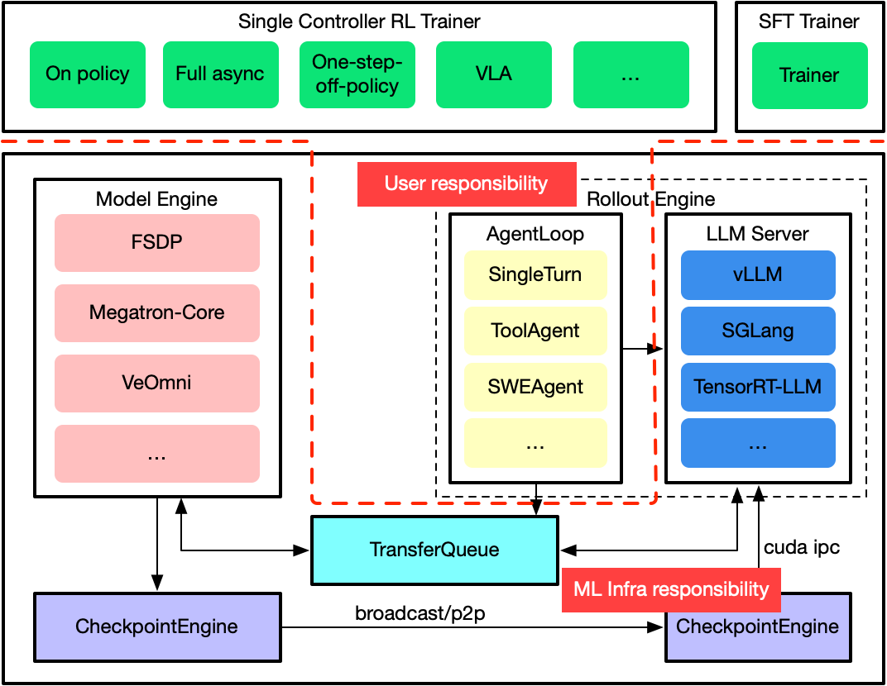
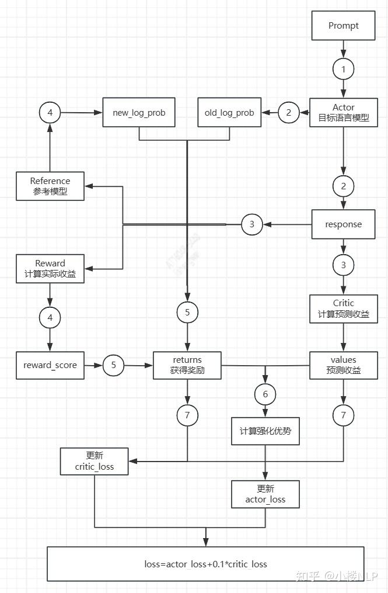
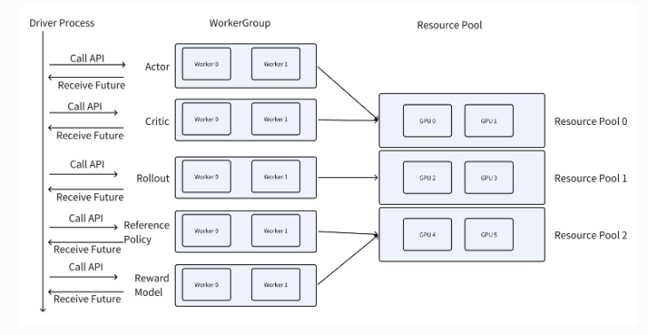
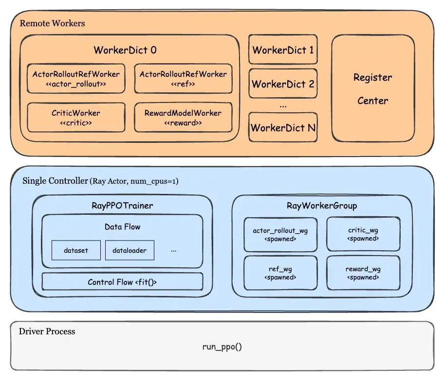
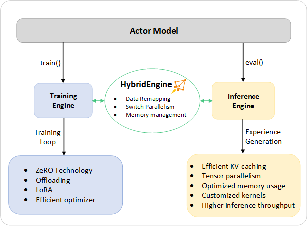

# verl 源码解析（汇报）

## verl的架构图



Trainer 是全局训练流程的 **单控制器**，负责组织整个训练流程。组织后文以 PPOTrainerSeparateAsync 为例。

Model Engine 是 Actor、Critic、Reference 等模型的 **训练计算后端**，负责模型初始化、分布式前后向、优化器更新和参数导出。

Rollout 是 Actor 的推理执行端，使用当前策略权重生成 Response 或完整轨迹中的模型输出；后文以 **vLLM 后端**为例。

TransferQueue 是生成侧与训练侧之间的 **轨迹数据通道**，用于保存和传递 Prompt、Response、Reward、LogProb、Value、模型版本及处理状态。

Checkpoint Engine 是训练侧到推理侧的在线权重同步抽象，负责把更新后的 **Actor 权重发送给 Rollout**；它不同于用于故障恢复的持久化训练 Checkpoint，后文以 **Mooncake** 传输后端为例。


## 强化学习算法的逻辑角色

强化学习的算法中会有具体的逻辑上的角色，这些逻辑上的角色在verl中抽象为role：

这里以ppo为例，展示实际强化学习的流程：



这张图展示的是 PPO 一轮训练中的数据流。

输入 Prompt 后，Actor 生成 response，并记录旧策略的 token log probability；

同一 response 会分别交给 Reward、Reference 和 Critic，得到奖励分数、参考策略概率与价值估计。

随后根据奖励和价值估计计算 returns 与优势，并结合新旧策略概率构造 actor loss，同时用 returns 监督 critic loss。

最后分别更新 Actor 和 Critic，进入下一轮采样与训练。


## Role的工作方式

ray





**Driver Process 就是 Trainer Controller**：它运行 PPO 训练主循环，是整个系统的控制面。按照 Ray 的执行模型，Driver 在本进程中创建并保存各 Ray Actor 的 ActorHandle；WorkerGroup 和 Manager 负责组织这些 ActorHandle，并把远程调用分发到独立的 Actor Worker、AgentLoop Worker、LoadBalancer、Rollout Worker 和 vLLM Server 进程。图中每条生命线表示一个实际进程，进程内箭头表示本地对象调用，跨进程箭头表示 Ray RPC 或权重、请求与轨迹数据的传递。整体工作流程如下：

```Plain Text
Trainer 组织流程
  → Role 描述职责
  → Role 映射到 Worker 类
  → WorkerGroup 管理一组 Worker
  → Worker 在 ResourcePool 上运行
  → Worker 内部调用 Model Engine 或 vLLM 完成计算
```


## verl的一次工作流


这里以ppo为例，讲解一次ppo的工作流：

初始化：

1. **配置解析：** 读取配置，根据配置确定训练需要的逻辑角色 role（actor，critic，ref，rollout）。

2. **控制器启动：** 初始化 Ray 和 PPO Trainer，前者的作用是管理 GPU 资源和远程进程，后者的作用是作为训练的整个控制器控制流程。

3. **数据通道准备：** 初始化 TransferQueue，再创建训练集、验证集和 DataLoader。TransferQueue 负责生成侧与训练侧之间的轨迹流转，DataLoader 则持续提供尚未生成 Response 的 Prompt。

4. **资源映射：** 建立资源池（ResourcePool），并把 Actor、Reference 和 Critic 等 Role 映射到资源池。资源池描述可供使用的节点和 GPU，Role 描述逻辑职责，二者结合后才确定某类 Worker 应当部署在哪里。

5. **WorkerGroup 创建：** 建立好资源池后创建 WorkerGroup，Worker 是真正执行模型初始化、前向传播、反向传播和参数更新的 **远程进程**；WorkerGroup 则向 Trainer 提供统一的分布式调用入口，使 Trainer 可以像调用一个逻辑对象一样调用整组 Worker。

6. **模型与 Hybrid Rollout 初始化：** 在已创建的 Worker 进程中初始化 Critic、Actor 和 Reference 的 Model Engine；随后基础 **Trainer 在 Actor 资源池上创建 Hybrid vLLM**，作为可在生成模式与训练模式之间切换的 Rollout 能力。

7. **Standalone Rollout 初始化：分离异步 Trainer（代码类 PPOTrainerSeparateAsync）** 再 **创建独立 Rollout 集群**：独立 vLLM 负责持续生成；每块 Rollout GPU 上的 **权重接收 Worker（CheckpointEngineWorker）** 负责接收新权重；**权重同步管理器（CheckpointEngineManager）** 统一暂停生成、触发传输并恢复服务。初始化完成后 **先同步一次**，使独立 vLLM 与当前 Actor 权重一致。


正式的训练过程：

8. **生成与 PPO 更新：** Trainer 把 Prompt 提交给 AgentLoop；AgentLoop 通过 vLLM 生成轨迹，RewardLoop 计算奖励并写入 TransferQueue。Trainer 再由 ReplayBuffer 选取完整轨迹，依次计算旧策略概率、参考概率、Value、优势与 Return，并更新 Critic 和 Actor。

9. **异步陈旧度控制：** 在 parameter\_sync\_step 次本地更新期间，独立 Rollout 仍使用上一次同步的 Actor 权重继续生成，因此新轨迹可能落后若干版本；ReplayBuffer 根据 global\_steps 和 max\_off\_policy\_threshold 控制可接受的陈旧度。

10. **周期收尾与权重同步：** 完成规定次数的本地 PPO 更新后，**Trainer 先按需保存训练 Checkpoint，再在 on\_step\_end 中通过 Checkpoint Engine 把新 Actor 权重同步到独立 Rollout**；之后执行验证、记录指标、清理本轮 TransferQueue 数据并递增全局步数，继续下一轮异步生成与训练。

下面是整个过程对应的伪代码：

```Python
# 入口：verl/trainer/main_ppo.py:134-156
trainer_cls = get_trainer_cls(config.trainer.v1.trainer_mode)
tq.init(config.transfer_queue)
trainer = trainer_cls(config=config)
trainer.init()
agent_loop_manager = AgentLoopManagerTQ.create(llm_client=trainer.get_llm_client(), ...)
trainer.fit(agent_loop_manager)

# 初始化：verl/trainer/ppo/v1/trainer_base.py:229-369
PPOTrainer._setup():
  init tokenizer / dataloader / resource pools / WorkerGroups
  init Critic and Actor/Reference Model Engine
  init RewardLoopManager
  create Hybrid LLMServerManager and CheckpointEngineManager

# 独立 Rollout：verl/trainer/ppo/v1/trainer_separate_async.py:72-101
PPOTrainerSeparateAsync._setup():
  super()._setup()
  create Standalone LLMServerManager
  create Standalone CheckpointEngineManager
on_init_end():
  sync Actor weights to Standalone and Hybrid Rollout

# 训练循环：verl/trainer/ppo/v1/trainer_base.py:443-465,509-584
while training:
  add_batch_to_generate()
  repeat parameter_sync_step times:
    batch = replay_buffer.sample()
    compute old_log_prob / ref_log_prob / values / advantage
    update_critic()
    update_actor()
  save checkpoint when needed; on_step_end()  # 同步新 Actor 权重
  validate / log / clear TransferQueue; global_steps += 1
```


我们关注的是vllm 和 mooncake的部分，分别是rollout和checkpointEngine，也就是我在过程中标粗的部分。


## vllm

### 整体位置

```Plain Text
图例：[Driver 对象] 同一 Trainer 进程内的 Python 对象
      [Ray 进程] 独立 Ray Actor 进程
      [进程内对象] 所属 Ray 进程中的成员对象

[Driver 进程] PPOTrainerSeparateAsync
  ├─ [Driver 对象] llm_server_manager
  │  └─ [Driver 对象] Hybrid vLLMReplica × N
  │     ├─ [Ray 进程] Actor Worker × world_size（复用训练 GPU）
  │     └─ [Ray 进程] vLLMHttpServer × 节点数
  │        └─ [进程内对象] AsyncLLM
  │
  ├─ [Driver 对象] standalone_server_manager
  │  ├─ [Driver 对象] Standalone vLLMReplica × M
  │  │  ├─ [Ray 进程] CheckpointEngineWorker × world_size
  │  │  └─ [Ray 进程] vLLMHttpServer × 节点数
  │  │     └─ [进程内对象] AsyncLLM
  │  └─ [Ray 进程] GlobalRequestLoadBalancer
  │
  └─ [调用方对象] FullyAsyncLLMServerClient
     └─ 请求 GlobalRequestLoadBalancer

切换到 Rollout 模式：把 Hybrid Server 加入全局负载均衡器
切换到 Trainer 模式：从负载均衡器移除 Hybrid Server 并休眠
```

verl 中有两类 vLLM Rollout。

**Hybrid vLLM** 与 Actor 训练 Worker 共用 GPU，用于验证，或在 Trainer 临时切到 Rollout 模式时参与生成；

**Standalone vLLM** 使用独立 Rollout GPU，在分离异步训练期间持续接收请求，是主要生成集群。



对外 Client 只连接 Standalone LLM Manager 的 GlobalRequestLoadBalancer，Hybrid Server 按模式动态加入或移出这个统一入口，因此两个 Manager 不会争抢同一请求。

### 提供服务的层级（请求视角）

```Plain Text
服务调用方
└─ AgentLoop / AgentLoopManager
   └─ FullyAsyncLLMServerClient
      └─ GlobalRequestLoadBalancer（统一服务入口，属于 standalone_server_manager）
         ├─ Standalone vLLM Server × M（常驻提供生成服务）
         │  └─ vLLMHttpServer → AsyncLLM
         └─ Hybrid vLLM Server × N（仅在 Rollout 模式加入）
            └─ vLLMHttpServer → AsyncLLM
```


### 工作过程

#### 创建流程

Hybrid LLM 和Standalone LLM Manager 两类 Replica 最终都会调用 `launch_servers()`：

1. 先确定各 Rollout Worker 所在的节点和 GPU，再在每个节点启动一个独立的 `vLLMHttpServer` Ray 进程。

2. Server 接收同节点的 Worker 句柄和 GPU 信息，并在自己的进程中创建 `AsyncLLM`，以异步方式提供生成服务。

```Python
# 1. llm_server.py:502-530：Manager 根据是否传入 WorkerGroup 选择部署模式
if self.worker_group:
    # Hybrid：复用现有 Actor Worker，不创建新的 Rollout Worker
    await replica.init_hybrid(self.worker_group)
else:
    # Standalone：为 Replica 新建 ResourcePool 和 CheckpointEngineWorker
    await replica.init_standalone()

# 2. replica.py:189-226：Standalone Replica 创建独立 Rollout WorkerGroup，再启动 Server
resource_pool_manager.create_resource_pool()
worker_group = RayWorkerGroup(
    resource_pool=self.resource_pool,
    ray_cls_with_init=self.get_ray_class_with_init_args(),
)
self.workers = worker_group.workers
await self.launch_servers()

# 3. vllm_async_server.py:1182-1247：按 Worker 所在节点创建 vLLMHttpServer Ray 进程
worker_infos = await asyncio.gather(...)
server = self.server_class.options(
    scheduling_strategy=NodeAffinitySchedulingStrategy(node_id=node_id, soft=False),
).remote(
    workers=workers,
    replica_rank=self.replica_rank,
    cuda_visible_devices=node_cuda_visible_devices,
)
await server.launch_server.remote(...)

# 4. vllm_async_server.py:454-467：每个 Server 进程内部启动 vLLM 异步引擎
engine_client = AsyncLLM.from_vllm_config(...)
```


#### 请求处理流程

1. AgentLoop 只调用 FullyAsync LLM Client。Client 把 request\_id 交给 GlobalRequestLoadBalancer，负载均衡器保持粘性路由并选择在途请求最少的 vLLM Server Process；

2. Server 将 Prompt Token 和采样参数交给 AsyncLLM，流式迭代完成后返回 TokenOutput。

```Python
# llm_server.py:218-278
server_id, server = await load_balancer.acquire_server.remote(request_id)
output = await server.generate.remote(
    prompt_ids=prompt_ids,
    sampling_params=sampling_params,
)
load_balancer.release_server.remote(server_id)

# vllm_async_server.py:531-647
generator = self.engine.generate(
    prompt=prompt,
    sampling_params=sampling_params,
    request_id=request_id,
)
async for output in generator:
    final_res = output
```


## Mooncake

- pd分离KV cache 的同步。

- checkpoint的传输。

主要关注第二点，即作为 **checkpoint\_engine 的 transfer layer 传递 checkpoint**。


### Mooncake 与接口边界

**Mooncake** 是面向分布式 AI 工作负载的数据传输与存储系统，其中 Transfer Engine 负责在进程和节点之间搬运 DRAM、GPU 显存或 NVMe\-oF 中的数据，**核心抽象是 Segment、已注册的 Buffer 和读写传输请求。** 本文中的 verl 集成只使用低层 。

每个参与传输的进程各自创建一个 TransferEngine，并先注册本地内存。远端通过 `session_id + pointer + length` 描述可访问的 Buffer；数据面由 Mooncake 执行单边 Read/Write，控制面则负责交换地址、长度和张量元数据。

### 常见接口与本项目用法

|接口|一般用途|verl 当前用法|
|---|---|---|
|`initialize` / `get_rpc_port`|初始化本地 TransferEngine，选择元数据握手方式与传输协议，并取得 RPC 端口。|使用 `P2PHANDSHAKE`；CUDA 走 `rdma`，NPU 走 `ascend_direct`，随后组合出 `session_id`。|
|`register_memory` / `batch_register_memory` / `unregister_memory`|将 CPU 或 GPU 内存注册为可传输 Buffer；生命周期结束后注销。|用 `batch_register_memory` 一次注册双 Bucket、完成信号发送区和两格完成信号接收区。|
|`open_segment` / `close_segment`|通用 BatchTransfer 模式下打开或关闭远端 Segment。|当前实现未显式调用；它使用 Python 同步接口直接传入远端 `session_id` 和地址。|
|`submit_transfer` / `get_transfer_status`<br>|提交异步批量 Read/Write 请求并查询完成状态，适合多个非连续数据块。|当前实现未直接使用；Bucket 已把多个权重聚合为连续区域，因此采用同步读写封装。|
|`transfer_sync_read`<br>|从远端已注册 Buffer 主动拉取数据到本地 Buffer。|Rollout Rank 按 Bucket 执行 RDMA Read，再按 `bucket_meta` 切分并逐个产出张量。|
|`transfer_sync_write`<br>|把本地 Buffer 写入远端已注册 Buffer。|每个 Bucket 消费完成后向上游写回 4 字节 Magic Signal，通知该槽位可以复用。|

**接口边界：**`self.store.send_obj` / `recv_obj` 不是 Mooncake TransferEngine 接口，而是 verl 用来传递 `bucket_meta`、远端地址、长度和结束标记的控制面通道；真正搬运权重字节的是 `transfer_sync_read`，`transfer_sync_write` 只负责完成确认。

```Python
# verl/checkpoint_engine/mooncake_checkpoint_engine.py:69-92
self.engine = TransferEngine()
self.engine.initialize(
    hostname,
    "P2PHANDSHAKE",
    "ascend_direct" if self.device == "npu" else "rdma",
    device_name,
)
self.session_id = f"{hostname}:{self.engine.get_rpc_port()}"
self.engine.batch_register_memory(
    [self.buf.data_ptr(), self.magic_buf.data_ptr(), self.magic_recv.data_ptr()],
    [2 * self.bucket_size, 4 * 1024, 8],
)

# verl/checkpoint_engine/mooncake_checkpoint_engine.py:270-308
self.engine.transfer_sync_read(
    self.buffer_info["session_id"], current.data_ptr(), prev_ptr, info["len"]
)
self.engine.transfer_sync_write(
    self.buffer_info["session_id"], self.magic_buf.data_ptr(), prev_magic_ptr, 4
)
```

### 整体位置

```Plain Text
图例：[Driver 对象] 控制与编排对象；[Ray 进程] 独立进程；[进程内对象] 成员对象

[Driver 进程] PPOTrainerSeparateAsync
  └─ [Driver 对象] standalone_checkpoint_manager
     （权重同步总编排器，不保存模型权重）
     ├─ [Driver 对象] Actor WorkerGroup（持有 Worker 句柄）
     │  └─ [Ray 进程] Actor Worker × world_size
     │     ├─ [进程内对象] Model Engine（FSDP / Megatron-Core / VeOmni）
     │     └─ [进程内对象] MooncakeCheckpointEngine（发送端）
     │
     └─ [Driver 对象] Standalone RolloutReplica
        ├─ [Ray 进程] CheckpointEngineWorker × world_size
        │  ├─ [进程内对象] MooncakeCheckpointEngine（接收端）
        │  └─ [进程内对象] ServerAdapter（把权重转交给 vLLM）
        │
        └─ [Ray 进程] vLLMHttpServer × 节点数
           └─ [进程内对象] AsyncLLM
              └─ vLLM Model / WorkerProc
```


### 工作流程

1. **创建抽象：** Standalone Rollout 初始化时，每块 GPU 创建一个 Standalone Rollout Worker（CheckpointEngineWorker）；

    当 backend=mooncake 时，该 Worker 内部实例化 Mooncake Checkpoint Engine 接收端。Actor 侧由 Standalone Weight\-Sync Manager（standalone\_checkpoint\_manager）创建对应发送端。

    ```Python
    # replica.py:189-239；checkpoint_engine/base.py:318-326
    worker_group = RayWorkerGroup(...CheckpointEngineWorker...)
    self.checkpoint_engine = CheckpointEngineRegistry.new(backend, bucket_size=...)
    ```

2. **启动时机：** Standalone Weight\-Sync Manager 在加载训练 Checkpoint 后先同步一次；此后每个训练 Step 结束，再把最新 Actor 权重同步给 Standalone Rollout。

    ```Python
    # trainer_separate_async.py:98-101,126-130
    on_init_end(): standalone_checkpoint_manager.update_weights(global_steps)
    on_step_end(): standalone_checkpoint_manager.update_weights(global_steps)
    ```

3. **建立拓扑：** Standalone Weight\-Sync Manager 暂停生成并收集通信信息，然后建立 Actor Rank 0 → Standalone Rollout Worker Rank 1…N 的流水链；其他 Actor Rank 只参与分布式参数导出。

    ```Python
    # verl/checkpoint_engine/mooncake_checkpoint_engine.py:104-116
    @classmethod
    def build_topology(
        cls,
        actor_wg_world_size: int,
        rollout_world_size: int,
        metadatas: list[dict],
    ):
        # 只有 Actor Rank 0 进入 Mooncake 流水链；其余 Actor Rank 标为 -1
        actor_wg_kwargs = {
            "rank": [0] + [-1] * (actor_wg_world_size - 1),
            "world_size": [rollout_world_size + 1] * actor_wg_world_size,
            "metadata": [metadatas[0]] * actor_wg_world_size,
        }

        # Standalone Rollout Worker 依次成为 Rank 1 ... N
        rollout_kwargs = {
            "rank": list(range(1, rollout_world_size + 1)),
            "world_size": [rollout_world_size + 1] * rollout_world_size,
            "metadata": [metadatas[0]] * rollout_world_size,
        }
        return actor_wg_kwargs, rollout_kwargs
    ```

4. **双 Bucket 传输：** Mooncake 预分配两块 Bucket 并交替写入。当前 Bucket 被下一级 RDMA Read 时，发送端准备另一块；收到 Magic Signal 后，已读完的 Bucket 才能复用。

    ```Python
    # 1. 初始化并注册两块数据 Bucket 与两格完成信号：mooncake_checkpoint_engine.py:83-91
    self.buf = torch.empty(2 * self.bucket_size, dtype=torch.uint8, device=self.device)
    self.magic_buf = torch.empty(4 * 1024, dtype=torch.uint8, device=self.device)
    self.magic_recv = torch.zeros(8, dtype=torch.uint8, device=self.device)
    self.engine.batch_register_memory(
        [self.buf.data_ptr(), self.magic_buf.data_ptr(), self.magic_recv.data_ptr()],
        [2 * self.bucket_size, 4 * 1024, 8],
    )

    # 2. 发送端：发送当前 Bucket 的地址与 metadata，再切到另一块：lines 172-227
    bufs = [self.buf[: self.bucket_size], self.buf[self.bucket_size :]]
    magic_slots = [self.magic_recv[:4], self.magic_recv[4:]]
    idx, should_wait = 0, False
    current = bufs[idx]

    if offset + weight.nbytes > self.bucket_size:
        info = {
            "bucket_meta": bucket_meta,
            "ptr": current.data_ptr(),
            "magic_ptr": magic_slots[idx].data_ptr(),
            "len": offset,
            "is_last": False,
        }
        self.store.send_obj(info, 1)
        idx ^= 1
        current = bufs[idx]
        if should_wait:
            # 复用这一格前，等待下一级写回完成信号
            await self.wait_for_complete(magic_slots[idx])
        should_wait = True

    # 最后一块重新构造 is_last=True 的 metadata，发出后也必须等待确认
    info = {
        "bucket_meta": bucket_meta,
        "ptr": current.data_ptr(),
        "magic_ptr": magic_slots[idx].data_ptr(),
        "len": offset,
        "is_last": True,
    }
    self.store.send_obj(info, 1)
    await self.wait_for_complete(magic_slots[idx])

    # 3. 接收端：从前一级 RDMA Read，消费后写回 Magic Signal：lines 252-315
    bufs = [self.buf[: self.bucket_size], self.buf[self.bucket_size :]]
    magic_slots = [self.magic_recv[:4], self.magic_recv[4:]]
    idx, current = 0, bufs[0]

    while True:
        info = self.store.recv_obj(self.rank - 1)
        if idx >= 2 and self.rank < self.world_size - 1:
            # 中间 Rank 复用本地 Bucket 前，也要等待下一级确认
            await self.wait_for_complete(magic_slots[idx % 2])

        prev_ptr = info["ptr"]
        prev_magic_ptr = info.get("magic_ptr")
        self.engine.transfer_sync_read(
            self.buffer_info["session_id"],
            current.data_ptr(),
            prev_ptr,
            info["len"],
        )

        for name, meta in info["bucket_meta"].items():
            dtype, shape = meta["dtype"], meta["shape"]
            size = dtype.itemsize * shape.numel()
            tensor = current[meta["offset"] : meta["offset"] + size].view(dtype=dtype).view(shape)
            yield name, tensor

        if prev_magic_ptr is not None:
            self.engine.transfer_sync_write(
                self.buffer_info["session_id"],
                self.magic_buf.data_ptr(),
                prev_magic_ptr,
                4,
            )
        else:
            self.engine.transfer_sync_write(
                self.buffer_info["session_id"],
                self.magic_buf.data_ptr(),
                prev_ptr,
                4,
            )
        idx += 1
        current = bufs[idx % 2]
        if info["is_last"]:
            break
    ```

5. **加载进 vLLM：** Standalone Rollout Worker 将权重交给 ServerAdapter，ServerAdapter 再通过以下两种方式送入独立的 vLLM 进程：

    - CUDA IPC 直接共享 GPU 显存中的 Tensor，避免额外的 CPU→GPU 拷贝；

    - 共享内存先把权重写入 CPU 共享内存，由 vLLM 读取后再复制到 GPU。

    前者速度更快，支持 CUDA IPC 时优先使用；后者用于设备不支持 CUDA IPC 的场景。最后由 AsyncLLM 内的 model\.load\_weights 更新模型。

    ```Python
    # 1. 初始化时选择路径：vllm_rollout.py:156-162
    self.use_shm = not is_support_ipc()

    # 2. CUDA IPC：共享 GPU Tensor 的 IPC handle
    # bucketed_weight_transfer.py:174-190
    buffer = torch.empty(bucket_size, device=device)
    self.socket.send_pyobj(reduce_tensor(buffer))

    # 3. 共享内存：共享 CPU 内存名称，接收后复制到 GPU
    shm = shared_memory.SharedMemory(name=shm_name, create=True, size=bucket_size)
    self.socket.send_pyobj({"name": shm_name, "size": bucket_size})
    tensor = tensor.to(self.device)  # bucketed_weight_transfer.py:284-285

    # 4. 两条路径最终都加载到 vLLM 模型
    # vllm_rollout/utils.py:380-384
    model.load_weights(param_updates)
    ```
